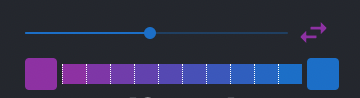

# Columns Elements

While developing https://columns.ai, we end up making some good UI components based on React, MUI and other projects. We think other people/projects may like them and find value them. 

So we pick those common components into this repo and open it to all. Contributing back to the community.
We look forward to your feedback and welcome any contributions.

This repo is released under Apache License 2.0.

### Run examples
Current repo is an react app, run it by `yarn start` simply.
The app is single page demoing all the components.

### Palette Maker
While working with data visualizations, we would like to enable users to set their own palette to style thier graphs. So palette maker is the one we use to interact with users. 
Check out this story example ( [LINK](https://columns.ai/story/c862e055-5d99-4239-83f7-efe84149a25e) ) to view how color was customized.

To use it
```javascript
// interpolate is the method to produce palette list with color values
import { interpolate } from './components/common';
import { PaletteMaker } from './components/PaletteMaker';
<PaletteMaker onchange={(p) => interpolate(p.begin, p.end, p.steps)} />
```



## More to come...
Reach out via Github issue or info@columns.ai
